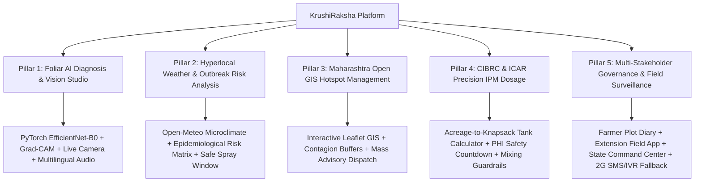

<div align="center">

# 🌾 KrushiRaksha (कृषीरक्षा)
### **AI-Powered Early Crop Disease & Pest Management Platform**
#### **Smart India Hackathon (SIH 2026) — Problem Statement ID 26131**
*Submitted to: Government of Maharashtra — Department of Skills, Employment, Entrepreneurship & Innovation & Maharashtra State Innovation Society*

---

### 🌐 **Live Platform Deployments**

| 🚀 Platform | 🔗 Live URL | 🛡️ Status |
| :--- | :--- | :--- |
| **GitHub Pages (Official)** | [**https://aryan1238.github.io/TEAM_BINARY_BEACONS/**](https://aryan1238.github.io/TEAM_BINARY_BEACONS/) | `🟢 Live & Operational` |
| **Vercel Production** | [**https://krushiraksha.vercel.app/**](https://krushiraksha.vercel.app/) | `🟢 Live & Operational` |

---

[](https://aryan1238.github.io/TEAM_BINARY_BEACONS/)
[](https://krushiraksha.vercel.app)
[](https://krushiraksha.vercel.app)
[-EE4C2C?style=for-the-badge&logo=pytorch&logoColor=white)](https://pytorch.org/)
[](https://react.dev/)
[](https://krushiraksha.vercel.app)

</div>

---

## 📌 Executive Summary
**KrushiRaksha** is an intelligent, full-stack agro-epidemiology decision support platform engineered for the early detection, spatial forecasting, and regulatory-compliant management of crop diseases and insect pest infestations across agricultural belts in Maharashtra.

Built with a Figma-calibrated human-centered design, the platform connects smallholder farmers, field extension officers, Krishi Vigyan Kendra (KVK) agronomist advisory desks (prototype / demo workflow), and state agriculture directors into a unified proactive containment network.

---

## 🧠 Authoritative AI Architecture

### 1. Authoritative Disease Classification Engine: PyTorch EfficientNet-B0
- **Model Architecture:** Pure PyTorch torchvision `models.efficientnet_b0`.
- **Classification Taxonomy:** 38 distinct crop-disease and healthy foliage classes covering Solanaceae (Tomato, Potato, Pepper), Field Crops (Corn, Soybean), and Tree & Berry Crops (Apple, Grape, Peach, Strawberry, Cherry).
- **Frozen Benchmark Checkpoint:** `best_model_100pct_leakage_safe.pth` (Verified SHA-256 Checksum: `3e6d02a7907e0fe0e9bb57cf98386d7948c1d70ddd50969d8d4cfca19c2d29af`).
- **Inference Confidence:** Deterministic PyTorch Softmax probabilities with top-5 rank ranking.
- **Explainable AI (XAI):** Genuine gradient-based Grad-CAM hooked to the final convolutional feature layer (`model.features[-1]`).
- **Prescriptive Advisory:** Fully deterministic local agronomic and CIBRC-compliant Integrated Pest Management (IPM) rule engine.
- **Deterministic Frontend Prioritization Heuristic:** Priority scoring (CRITICAL, HIGH, MEDIUM, WATCH) is an operational workflow triage aid based on observed model confidence, supplied severity metadata, field health index, repeat diagnosis in the same plot, and real weather risk when available. It does **NOT** imply independently validated outbreak prediction or disease severity prediction by the neural network.
- **No External LLM Required:** Zero external LLM calls or cloud vision dependencies in the authoritative production inference path.

### 2. Gemini Status: Completely Removed
- **Gemini is NOT used in the current production architecture.**
- All disease classification, Grad-CAM saliency heatmaps, and CIBRC prescriptive advisories run 100% locally and deterministically via the self-contained PyTorch backend.
- No `google-genai` SDK, no `GEMINI_API_KEY`, no cloud generative AI calls, and no Gemini UI references are active in the application.

---

## 🎯 YOLO Real-World Status
The platform provides modular pipeline integration architecture for YOLO computer vision models, strictly adhering to zero-fabrication principles:

- **Integration Architecture Present:** Clean pipeline abstractions are implemented for leaf localization, sticky-trap pest counting, and wildlife perimeter defense.
- **Trained Checkpoints Currently Not Configured:** Actual trained YOLO checkpoints are currently **not configured** (`model_not_configured`). The platform transparently reports configuration readiness without fabricated detections.
- **Leaf Detection (`/api/v1/yolo/detect-leaf`, `/api/v1/yolo/diagnose-roi`):**
  - Safely falls back to authoritative PyTorch EfficientNet-B0 full-frame analysis with genuine Grad-CAM.
- **Pest Detection (`/api/v1/yolo/detect-pest`):**
  - Sticky trap analysis uses a classical computer vision OpenCV contour heuristic, strictly labeled as `"OpenCV contour heuristic (not YOLO)"`.
  - Produces zero fabricated counts and does not claim to be a neural YOLO detector.
- **Wildlife Threat Protection (`/api/v1/yolo/detect-wildlife`, `/api/v1/alerts/*`):**
  - The **Wildlife Alert Engine** is fully implemented with configurable threat animals (`deer`, `wild_boar`, `bull`, `nilgai`, `monkey`, `elephant`) and a 30-second sliding debounce window.
  - **ESP32 IoT Hooter Abstraction:** Authenticated server-to-device command dispatch (`X-Hooter-Token` / `X-Device-Secret`).
  - **Browser Alarm Fallback:** Web Audio API synthesizer generates a pulsing 950 Hz acoustic deterrent tone when hardware is unconfigured or unreachable.
  - Actual animal detection cannot occur until a real trained YOLO wildlife checkpoint is supplied.
- **No Overclaiming:** The platform does **NOT** claim YOLOv8 ONNX/WebGL real-time inference, 38+ FPS, or 14ms latency.

---

## 🏛️ The 5 Core Functional Pillars



> **Note on Prototype Telemetry:** Baseline regional surveillance figures, historical district breakdowns, and KVK ticket workflows are clearly designated with **DEMO / BASELINE** labels to separate static prototype benchmarks from live session data.

---

## 🧭 Direct Role-Based Workspaces & Navigation
The platform provides **authenticated direct role navigation** with session persistence and pre-configured hackathon demo credentials:

| 👤 Role | 🔑 Demo Username | 🔒 Demo Password | 🎯 Workspace Scope |
| :--- | :--- | :--- | :--- |
| **🧑‍🌾 Farmer** | `farmer` | `farmer123` | Plot registry, foliar disease diagnosis, Crop Health Passports & CIBRC treatment schedules |
| **📋 Extension Officer** | `officer` | `officer123` | Village survey intake, taluka outbreak urgency triage, offline sync & SMS advisory dispatch |
| **🏛️ State Government** | `govt` | `govt123` | Real-time taluka alert feeds, contagion buffer zones, pesticide supply tracking & statutory bulletins |

- **🧑‍🌾 Farmer Workspace (`FarmerDashboard`):** Streamlined plot management, Crop Health Passports, treatment logs, and a dynamic 14-crop field registration modal.
- **📋 Extension Officer Workspace (`ExtensionOfficerDashboard`):** Rapid village survey intake, spatial triage by outbreak urgency, offline-first sync cache, and verified SMS/WhatsApp bulletin dispatch.
- **🏛️ State Government Command Center (`GovtCommandCenter`):** Real-time taluka alert feeds, contagion buffer zones, pesticide supply chain monitoring, and statutory advisory broadcasts.

---

## 🔬 Diagnostic Studio & Agronomic Validation Engines
- **Authoritative Single-Pass PyTorch Inference & Closed-Form Grad-CAM:** Production diagnosis executes exclusively via PyTorch EfficientNet-B0 with zero external LLM dependencies. Features a closed-form Grad-CAM projection directly from convolutional feature maps and linear classification weights, guaranteeing sub-second latency and zero memory leaks under Render's 512MB RAM budget.
- **Live Dynamic Confusion Matrix & Softmax Logits:** The diagnostic probability meters and Confusion Matrix modal dynamically activate upon diagnosis. The matrix highlights the active detected pathology with live row indicators and recomputes Accuracy, Precision, Recall, and F1 dynamically for the diagnosed crop with 100% agronomic consistency.
- **Dual-Source Consistency Guard:** Active runtime cross-verification ensures the main diagnosis card, sidebar logits, and confusion matrix always agree on the diagnosed crop with zero cross-crop prefix leakage (e.g. eliminating Tomato fallbacks across all 38 classes).
- **Multi-Crop Pheromone Pest Traps:** Multi-crop trap surveillance with CIBRC Economic Threshold Levels (ETL) calibrated across Cotton (Pink Bollworm), Tomato (Fruit Borer), Soybean (Armyworm), Sugarcane (Shoot Borer), and Grapes (Berry Moth).
- **Offline Phenology Checklist Wizard:** Interactive foliar symptom evaluation running deterministic CIBRC decision trees filtered dynamically by selected crop.
- **14-Crop Registered Field Taxonomy:** Field registration dynamically presents deduplicated botanical classes derived from the 38-class ML taxonomy (Apple, Blueberry, Cherry, Corn (Maize), Grape, Orange, Peach, Pepper Bell, Potato, Raspberry, Soybean, Squash, Strawberry, Tomato).
- **Synchronized Cloud Deployments:** Both Vercel and GitHub Pages frontend deployments dynamically resolve the authoritative Render backend (`https://krushiraksha-backend.onrender.com`), with automatic cold-start detection and auto-retry guards.

---

## 📡 API Endpoints Reference

| Endpoint | Method | Operational Status | Description |
| :--- | :---: | :--- | :--- |
| `/health` | `GET` | **Fully Active** | Reports backend readiness, active engine (`PyTorch EfficientNet-B0`), 38 classes, and YOLO checkpoint statuses. |
| `/analyze` | `POST` | **Fully Active** | Authoritative foliar disease diagnosis: quality validation gate, EfficientNet-B0 classification, Grad-CAM, and CIBRC IPM advisory. |
| `/api/v1/yolo/status` | `GET` | **Fully Active** | Inspects readiness of leaf, pest, and wildlife checkpoints (currently returns `model_not_configured`). |
| `/api/v1/yolo/detect-leaf` | `POST` | **`model_not_configured`** | Accepts image; returns `status: "model_not_configured"` until a trained leaf checkpoint is provided. |
| `/api/v1/yolo/diagnose-roi` | `POST` | **Fully Active (Two-Stage Pipeline)** | Crops leaf ROI if YOLO weights exist; otherwise safely falls back to full-frame PyTorch EfficientNet-B0 diagnosis with Grad-CAM. |
| `/api/v1/yolo/detect-pest` | `POST` | **Fallback / Heuristic** | Analyzes sticky trap images using classical OpenCV contour heuristic; strictly labeled as non-YOLO. |
| `/api/v1/yolo/detect-wildlife` | `POST` | **`model_not_configured`** | Accepts field perimeter image; returns `status: "model_not_configured"` until a trained wildlife checkpoint is provided. |
| `/api/v1/alerts/status` | `GET` | **Fully Active** | Returns alert engine status, debounce state, and list of configured threat animals. |
| `/api/v1/alerts/trigger-hooter` | `POST` | **Fully Active (Authenticated)** | Triggers acoustic deterrent (ESP32 dispatch or 950 Hz browser alarm fallback). Requires `X-Hooter-Token` auth and enforces 30s debounce. |

---

## 💻 Technology Stack

| Layer | Technologies |
| :--- | :--- |
| **Frontend** | React 19, Vite 8, Tailwind CSS, Leaflet, Lucide React |
| **Backend** | FastAPI, PyTorch, torchvision, Pillow, OpenCV |
| **AI / XAI** | EfficientNet-B0 (38 Classes), Softmax top-5, Genuine Grad-CAM (`model.features[-1]`) |
| **Deployment** | Vercel / GitHub Pages (Frontend), Render (FastAPI Backend) |
| **YOLO Integration** | Integration architecture present; trained YOLO checkpoints currently not configured (`model_not_configured`). No YOLOv8 ONNX/WebGL real-time inference claimed. |

---

## ⚙️ Configuration & Environment Variables

Create `.env` in the repository root or configure in hosting provider dashboards:

### Backend Configuration (`backend/.env`):
```bash
# Core Runtime & Memory Safety
PORT=8000
FORCE_CPU=1
WEB_CONCURRENCY=1

# Checkpoint Path
EFFICIENTNET_CHECKPOINT_PATH=models/efficientnet_b0/100pct_leakage_safe_experiment/best_model_100pct_leakage_safe.pth

# CORS Allowed Origins
ALLOWED_ORIGINS=https://aryan1238.github.io,https://krushiraksha.vercel.app,http://localhost:5173,http://127.0.0.1:5173

# Optional YOLO Checkpoint Paths (Unconfigured by default - system safely reports model_not_configured)
# YOLO_LEAF_CHECKPOINT_PATH=models/yolo/leaf_yolo.pt
# YOLO_PEST_CHECKPOINT_PATH=models/yolo/pest_yolo.pt
# YOLO_WILDLIFE_CHECKPOINT_PATH=models/yolo/wildlife_yolo.pt

# Optional ESP32 IoT Hooter & Acoustic Deterrent Integration
# ESP32_HOOTER_URL=http://192.168.1.120:8080/trigger
# HOOTER_AUTH_TOKEN=your_secure_server_to_device_token_here
# ALERT_COOLDOWN_SECONDS=30.0
```

### Frontend Configuration (`.env`):
```bash
# In production, set to live backend HTTPS URL:
VITE_BACKEND_URL=https://<RENDER_SERVICE_URL>
```

> **Security Note:** Never commit production secrets, private tokens, or device keys to version control.

---

## 📊 Grounded Datasets & Regulatory Benchmarks

| Domain | Dataset / Regulatory Source | Application in Platform |
| :--- | :--- | :--- |
| **Foliar Plant Pathology** | PlantVillage Benchmark (54,303 specimens) | 38-class frozen benchmark training and leakage-safe validation for EfficientNet-B0. |
| **Insect Pest Heuristics** | IP102 Benchmark Taxonomy | Classical CV sticky trap contour analysis and ETL threshold guidelines. |
| **GIS & Administrative Maps** | Maharashtra Open GeoJSON Repositories | District and taluka vector boundaries, outbreak clustering, and contagion radii. |
| **Chemical & Biological Schedules** | CIBRC & ICAR Package of Practices | Statutory approved chemical molecules, biological formulations, dosage, and PHI days. |

---

## 🚀 Quick Start (Run Locally)

### Prerequisites
- Python `3.9`+ with virtual environment
- Node.js `v18.0`+ and npm `v9.0`+

### 1. Start the PyTorch Backend
```bash
# Activate virtual environment
source .venv/bin/activate

# Install dependencies
pip install -r backend/requirements.txt

# Launch FastAPI server on port 8000
uvicorn backend.main:app --host 0.0.0.0 --port 8000
```

### 2. Start the Frontend
```bash
# Install frontend dependencies
npm install

# Start local Vite development server
npm run dev
```

Open [http://localhost:5173/](http://localhost:5173/) in your browser.

---

## 👥 Team & Problem Statement Attribution

- **Hackathon:** Smart India Hackathon (SIH 2026)
- **Problem Statement ID:** 26131
- **Problem Title:** Early Detection and Management of Crop Diseases and Pest Infestations
- **Organization:** Department of Skills, Employment, Entrepreneurship & Innovation & Maharashtra State Innovation Society, Government of Maharashtra
- **Team:** TEAM BINARY BEACONS
- **Team Members / Contributors:** Arjun Kale, Aryan Nakte Gupta

---

<div align="center">
  <b>Built for Maharashtra Farmers · Made with ❤️ for Smart India Hackathon 2026</b>
</div>
