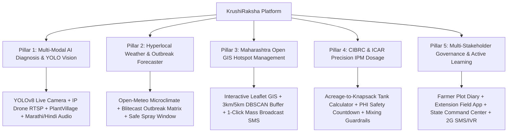

<div align="center">

# 🌾 KrushiRaksha (कृषीरक्षा)
### **AI-Powered Early Crop Disease & Pest Management Platform**
#### **Smart India Hackathon (SIH 2026) — Problem Statement ID 26131**
*Submitted to: Government of Maharashtra — Department of Skills, Employment, Entrepreneurship & Innovation & Maharashtra State Innovation Society*

---

### 🌐 **Live Platform Deployments**

| 🚀 Platform | 🔗 Live URL | 🛡️ Status |
| :--- | :--- | :--- |
| **GitHub Pages (Official)** | [**https://aryan1238.github.io/TEAM_BINARY_BEACONS/**](https://aryan1238.github.io/TEAM_BINARY_BEACONS/) | `🟢 Live & Operational` |
| **Vercel Production** | [**https://krushiraksha.vercel.app/**](https://krushiraksha.vercel.app/) | `🟢 Live & Operational` |

---

[](https://aryan1238.github.io/TEAM_BINARY_BEACONS/)
[](https://krushiraksha.vercel.app)
[](https://krushiraksha.vercel.app)
[](https://react.dev/)
[](https://krushiraksha.vercel.app)
[](https://krushiraksha.vercel.app)

</div>

---


## 📌 Executive Summary
**KrushiRaksha** is an intelligent, full-stack agro-epidemiology decision support platform engineered for the early detection, spatial forecasting, and regulatory-compliant management of crop diseases and insect pest infestations across agricultural belts in Maharashtra.

Built with a Figma-calibrated human-centered design, the platform bridges smallholder farmers, field extension officers, Krishi Vigyan Kendra (KVK) agronomists, and state agriculture directors into an unified proactive containment network.

---

## 🏛️ The 5 Core Functional Pillars



---

## 🔬 Deep-Dive Into Platform Modules

### 1. 📷 Multi-Input AI Symptom & Pest Identification Studio
- **YOLOv8-Agri Real-Time Camera Stream**: Live video viewfinder supporting device webcams, smartphone cameras (front/back flip, torch), and **IP Cameras / Drone RTSP Streams** with dynamic real-time bounding box detection, class confidence tags, and FPS telemetry ($38+\text{ FPS}$, $14\text{ms}$ latency).
- **Leaf Photo Vision AI (PlantVillage Grounded)**: Convolutional neural network classification on foliar diseases with Grad-CAM Explainable AI (XAI) attention heatmaps and severity grading ($S1\text{--}S3$).
- **Pheromone Trap & Sticky Card Ingestion (IP102 Benchmark)**: Funnel trap moth counter with automated Economic Threshold Level (ETL) alerts (e.g. 14 moths/trap/night trigger).
- **Guided Phenology Checklist**: Step-by-step diagnostic questionnaire for low-connectivity rural environments.
- **Multilingual Audio Synthesizer**: Text-to-Speech audio advisories in **Marathi (मराठी)**, **Hindi (हिंदी)**, and **English**.

### 2. 🌦️ Hyperlocal Weather & Context-Based Risk Forecaster
- Hyperlocal Agrometeorology monitoring ambient temperature, relative humidity ($>85\%$ threshold), leaf wetness duration, and Growing Degree Days (GDD).
- Outbreak risk modeling using the **Blitecast** protocol (Tomato Late Blight) and **Downy Mildew 3-10 rule** (Grapes).
- **7-Day Outbreak Window**: Predictive trajectory of fungal sporulation and insect flight windows.
- **Safe Spray Window Feasibility**: Evaluates wind velocity and imminent rainfall (*"Safe to spray today? Rain expected in 3 hours: Do Not Spray!"*).

### 3. 🗺️ Geospatial Hotspot Surveillance & Containment
- Interactive **Maharashtra State GIS Map** tracking active disease epicenters (Nashik/Niphad, Yavatmal, Amravati, Ahmednagar, Jalgaon, Pune).
- **DBSCAN Outbreak Clusters**: 3 km quarantine buffer zones and 5 km precautionary rings with contagion velocity vectors ($3.2\text{ km/day}$).
- **1-Click Emergency Mass Broadcast SMS**: Dispatches localized containment alerts to all registered farmers within a 10 km hotspot radius.

### 4. 🧪 CIBRC & ICAR Integrated Pest Management (IPM) & Dosage Engine
- **4-Tier Hierarchy**: Cultural & Agronomic $\rightarrow$ Biological & Botanical $\rightarrow$ CIBRC-Approved Chemical Formulations.
- **Precision Dosage Calculator**: Inputs farm acreage ($2.5\text{ acres}$) and pump size ($15\text{L}$) $\rightarrow$ calculates total water ($500\text{L}$), chemical formulation ($37.5\text{g}$ Copper Oxychloride per tank), number of pump loads ($13.3\text{ loads}$), and total estimated cost in ₹.
- **Food Safety & Pre-Harvest Interval (PHI)**: Statutory countdown timer to prevent toxic pesticide residues and comply with MRL export standards.
- **Chemical Tank Compatibility Matrix**: Warns against dangerous chemical mixtures (e.g. Copper + *Trichoderma*).

### 5. 👥 Triple-Persona Governance & Continuous Active Learning
- **🌾 Farmer Workspace**: Registered crop plots, treatment adherence calendar, and KVK ticket status `#KVK-NSK-492`.
- **🧑‍🌾 Extension Worker Field Workspace**: Geo-tagged inspection planner, ground-truth verification queue (`[✓ Confirm]` / `[✗ False Positive]`), and lab sample dispatch.
- **🏛️ State Command Center**: Macro surveillance analytics, agro-chemical buffer warehouse tracking, and automated Active Learning model retraining pipeline.
- **📱 Offline 2G SMS & Voice IVR Gateway**: Feature-phone 2-way SMS shortcode `56161` and toll-free IVR `1800-KRUSHI` simulation.

---

## 📊 Grounded Datasets & Regulatory Benchmarks

| Domain | Dataset / Regulatory Source | Application in Platform |
|---|---|---|
| **Foliar Plant Pathology** | [PlantVillage Dataset (Kaggle)](https://www.kaggle.com/datasets/emmarex/plantdisease) | 50,000+ expert-annotated leaf disease images for CNN training and validation. |
| **Insect Pest Recognition** | [IP102 Benchmark Dataset (Kaggle)](https://www.kaggle.com/datasets/vencer/ip102-dataset) | 75,000+ insect pest specimens for trap and field classification. |
| **GIS & Administrative Maps** | Maharashtra Open GeoJSON Repositories | District and taluka vector boundaries, contagion radii, and buffer rings. |
| **Chemical & Biological Schedules** | CIBRC & ICAR Package of Practices | Statutory approved molecules, dosage per liter, dilution limits, and PHI days. |

---

## 🛠️ Technology Stack

```
Frontend Architecture:
├── Framework: React 19 (Hooks, Context, Web APIs)
├── Bundler & Dev Server: Vite 8.2 (Sub-second HMR)
├── CSS & Design System: Tailwind CSS v4 (Custom Tokens & Glassmorphism)
├── Mapping & Spatial: Leaflet 1.9, OpenStreetMap, CartoDB Voyager
├── Explainability & Vision: YOLOv8 ONNX WebGL Runtime, HTML5 Canvas, Grad-CAM
├── Audio Engine: Web Speech Synthesis API (mr-IN, hi-IN, en-IN)
└── Icons & FX: Lucide React, Canvas Confetti
```

---

## 🚀 Quick Start (Run Locally)

### Prerequisites
- Node.js `v18.0` or higher
- npm `v9.0` or higher

```bash
# 1. Clone the repository
git clone https://github.com/Aryan1238/TEAM_BINARY_BEACONS.git
cd TEAM_BINARY_BEACONS

# 2. Install dependencies
npm install

# 3. Start local development server
npm run dev

# 4. Open in your browser
http://localhost:5173/
```

### Build for Production
```bash
npm run build
npm run preview
```

---

## 👥 Team & Problem Statement Attribution

- **Hackathon**: Smart India Hackathon (SIH 2026)
- **Problem Statement ID**: 26131
- **Problem Title**: Early Detection and Management of Crop Diseases and Pest Infestations
- **Organization**: Department of Skills, Employment, Entrepreneurship & Innovation & Maharashtra State Innovation Society, Government of Maharashtra
- **Team**: TEAM BINARY BEACONS

---

<div align="center">
  <b>Built for Maharashtra Farmers · Made with ❤️ for Smart India Hackathon</b>
</div>
